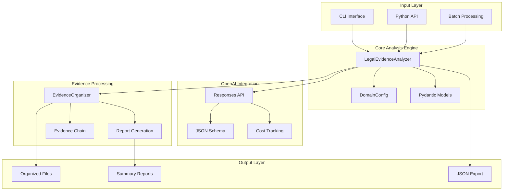
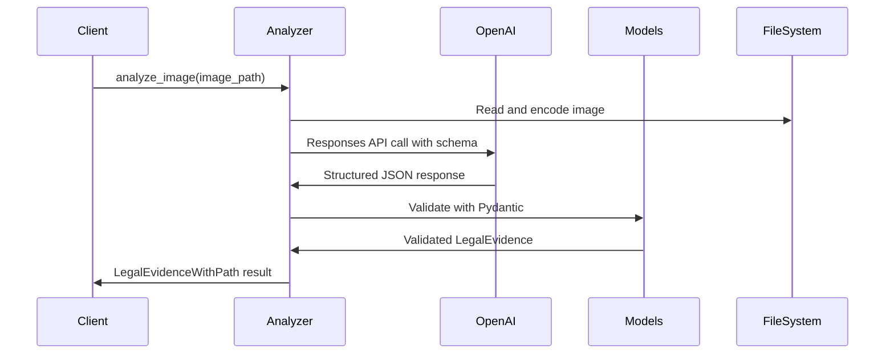
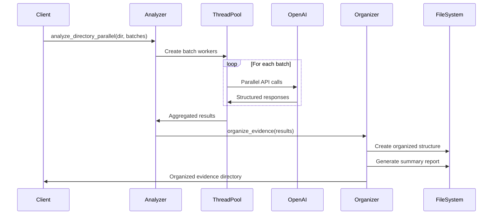

# System Architecture - Legal Evidence Analysis System V2

## Table of Contents

1. [Overview](#overview)
2. [Design Philosophy](#design-philosophy)
3. [Core Components](#core-components)
4. [Data Flow Architecture](#data-flow-architecture)
5. [OpenAI Integration](#openai-integration)
6. [Multi-Domain Framework](#multi-domain-framework)
7. [Concurrent Processing](#concurrent-processing)
8. [Evidence Organization](#evidence-organization)
9. [Error Handling & Reliability](#error-handling--reliability)
10. [Security & Compliance](#security--compliance)
11. [Performance Characteristics](#performance-characteristics)

---

## Overview

The Legal Evidence Analysis System V2 represents a complete architectural redesign focused on professional legal workflows. The system leverages OpenAI's structured output capabilities to provide consistent, court-ready forensic image analysis across multiple legal domains.

### Key Architectural Principles

- **Structured Output First**: Built around OpenAI's guaranteed JSON schema compliance
- **Multi-Domain Support**: Extensible framework supporting six legal specializations
- **Evidence Chain Integrity**: Maintains forensic standards throughout the analysis pipeline
- **Thread-Safe Concurrency**: Production-ready parallel processing with cost tracking
- **Legal Framework Integration**: Domain-specific analysis aligned with relevant legislation

### System Architecture Diagram



---

## Design Philosophy

### 1. Structured Output as Foundation

The V2 architecture is built entirely around OpenAI's structured output capabilities, ensuring consistent, reliable legal evidence extraction.

**Key Design Decision:**
```python
# ✅ V2 Architecture - Structured Output
response = client.responses.create(
    model="gpt-4.1-mini",
    input=[...],
    text={
        "format": {
            "type": "json_schema",
            "name": "legal_evidence",
            "schema": legal_evidence_schema
        }
    }
)
```

**Benefits:**
- Guaranteed schema compliance for legal proceedings
- Elimination of parsing errors and inconsistent outputs
- Court-ready structured evidence format
- Predictable integration with legal case management systems

### 2. Domain-Centric Design

Rather than a one-size-fits-all approach, the system provides specialized configurations for different legal domains.

```python
class LegalDomain(str, Enum):
    employment_law = "employment_law"
    personal_injury = "personal_injury"
    criminal_law = "criminal_law"
    civil_litigation = "civil_litigation"
    regulatory_compliance = "regulatory_compliance"
    family_law = "family_law"
```

### 3. Evidence Chain Integrity

Every component maintains forensic evidence standards with complete traceability from source image to final analysis report.

### 4. Professional Legal Workflow Integration

Designed for integration into existing legal practices with minimal disruption to established evidence handling procedures.

---

## Core Components

### 1. Legal Evidence Analyzer

**Primary Responsibility:** Forensic image analysis using OpenAI Vision API with domain-specific prompts.

**Key Features:**
- Thread-safe cost tracking across concurrent operations
- Domain-specific analysis prompts aligned with relevant legal frameworks
- Automatic base64 encoding and image preprocessing
- Structured output validation using Pydantic models

**Architecture Pattern:**
```python
class LegalEvidenceAnalyzer:
    def __init__(self, api_key: str, legal_domain: LegalDomain):
        self.client = OpenAI(api_key=api_key)
        self.legal_domain = legal_domain
        self.total_cost = 0.0
        self.lock = threading.Lock()  # Thread-safe cost tracking
```

### 2. Domain Configuration System

**Primary Responsibility:** Legal domain-specific configuration management.

**Key Features:**
- Evidence type mapping per legal domain
- Directory organization structures
- Domain-specific analysis prompts
- Legal framework alignment

**Configuration Architecture:**
```python
class DomainConfig:
    @staticmethod
    def get_evidence_types(domain: LegalDomain) -> List[str]:
        # Domain-specific evidence type mappings

    @staticmethod
    def get_directory_structure(domain: LegalDomain) -> List[str]:
        # Legal domain directory organization

    @staticmethod
    def get_analysis_prompt(domain: LegalDomain) -> str:
        # Domain-specific forensic analysis prompts
```

### 3. Evidence Organization System

**Primary Responsibility:** Automated evidence categorization and file management.

**Key Features:**
- Severity-based evidence triage
- Domain-specific directory structures
- Automatic report generation
- Evidence chain documentation

**Organization Architecture:**
```python
class EvidenceOrganizer:
    def __init__(self, output_dir: Path, legal_domain: LegalDomain):
        self.setup_directories()  # Create domain-specific structure

    def organize_evidence(self, results: List[LegalEvidenceWithPath]):
        # Categorize and organize evidence files

    def generate_summary_report(self, results: List[LegalEvidenceWithPath]):
        # Create comprehensive legal summary
```

### 4. Pydantic Data Models

**Primary Responsibility:** Structured data validation and evidence format standardization.

**Model Hierarchy:**
```
LegalEvidence (Base)
├── evidence_type: EvidenceType
├── severity_level: SeverityLevel
├── legal_relevance: str
├── compliance_violations: str
├── expert_witness_notes: str
├── immediate_action_required: bool
├── evidence_strength: str
└── supporting_documentation_needed: str

LegalEvidenceWithPath (Extended)
└── image_path: str
```

---

## Data Flow Architecture

### Single Image Analysis Flow



### Batch Processing Flow



---

## OpenAI Integration

### API Architecture

The system exclusively uses OpenAI's Responses API for guaranteed structured output compliance.

#### Correct V2 Pattern
```python
response = client.responses.create(
    model="gpt-4.1-mini",
    input=[{
        "role": "user",
        "content": [{
            "type": "input_text",
            "text": domain_specific_prompt
        }, {
            "type": "input_image",
            "image_url": f"data:image/jpeg;base64,{encoded_image}"
        }]
    }],
    text={
        "format": {
            "type": "json_schema",
            "name": "legal_evidence",
            "schema": {
                "type": "object",
                "properties": {
                    "evidence_type": {
                        "type": "string",
                        "enum": domain_specific_evidence_types
                    },
                    # ... complete schema definition
                },
                "required": all_required_fields,
                "additionalProperties": False
            }
        }
    }
)
```

### Schema Enforcement

The JSON schema is dynamically configured based on the legal domain:

```python
def get_schema_for_domain(domain: LegalDomain) -> dict:
    evidence_types = DomainConfig.get_evidence_types(domain)
    return {
        "type": "object",
        "properties": {
            "evidence_type": {
                "type": "string",
                "enum": evidence_types  # Domain-specific types
            },
            # ... rest of schema
        }
    }
```

### Cost Tracking Architecture

```python
class LegalEvidenceAnalyzer:
    def analyze_image(self, image_path: Path):
        # ... API call ...

        # Thread-safe cost tracking
        with self.lock:
            self.total_cost += 0.0014  # GPT-4.1 Mini cost per image

        return validated_result
```

---

## Multi-Domain Framework

### Domain-Specific Configuration

Each legal domain has tailored configuration for optimal analysis:

#### Employment Law Configuration
```python
EMPLOYMENT_LAW_CONFIG = {
    "evidence_types": [
        "workplace_safety", "discrimination", "harassment", "policy_violation"
    ],
    "directory_structure": [
        "critical_violations", "workplace_safety_violations",
        "discrimination_evidence", "documentation"
    ],
    "analysis_focus": "Health & Safety at Work Act violations, discrimination, harassment"
}
```

#### Personal Injury Configuration
```python
PERSONAL_INJURY_CONFIG = {
    "evidence_types": [
        "negligence", "premises_liability", "product_defect", "medical_evidence"
    ],
    "directory_structure": [
        "critical_violations", "negligence_evidence",
        "premises_liability", "medical_evidence", "documentation"
    ],
    "analysis_focus": "Negligence, premises liability, product defects, medical evidence"
}
```

### Extensibility Design

Adding new legal domains requires minimal code changes:

```python
# 1. Add to LegalDomain enum
class LegalDomain(str, Enum):
    new_domain = "new_domain"

# 2. Configure domain-specific settings
def get_evidence_types(domain: LegalDomain) -> List[str]:
    evidence_map = {
        # ... existing domains ...
        LegalDomain.new_domain: ["new_evidence_type", "another_type"]
    }

# 3. Define analysis prompt
def get_analysis_prompt(domain: LegalDomain) -> str:
    prompts = {
        # ... existing prompts ...
        LegalDomain.new_domain: "Domain-specific analysis instructions..."
    }
```

---

## Concurrent Processing

### Thread Pool Architecture

The system uses ThreadPoolExecutor for optimal concurrent processing:

```python
def analyze_directory_parallel(self, images_dir: Path, num_batches: int = 2):
    # Split images into batches
    batches = create_batches(all_images, num_batches)

    # Process batches concurrently
    with ThreadPoolExecutor(max_workers=num_batches) as executor:
        batch_futures = {
            executor.submit(self.analyze_image_batch, batch): batch_idx
            for batch_idx, batch in enumerate(batches)
        }

        # Collect results as they complete
        for future in as_completed(batch_futures):
            batch_results = future.result()
            all_results.extend(batch_results)

    return all_results
```

### Rate Limit Management

#### API Rate Limit Compliance
- **Default Workers**: 3 concurrent API calls (respects OpenAI rate limits)
- **Configurable Batching**: Adjustable based on API tier and usage patterns
- **Automatic Retry Logic**: Built-in handling for transient API failures

#### Thread Safety Guarantees

1. **Cost Tracking**: Thread-safe accumulation using locks
2. **File I/O**: Each thread handles separate files, no conflicts
3. **API Calls**: Independent OpenAI client instances per thread
4. **Result Aggregation**: Thread-safe result collection

---

## Evidence Organization

### Directory Structure Generation

The system creates domain-specific evidence organization:

#### Employment Law Structure
```
evidence/
├── critical_violations/           # Severity: critical
│   ├── safety_violation_001.jpg
│   ├── safety_violation_001.txt   # Analysis report
│   └── ...
├── workplace_safety_violations/   # Type: workplace_safety
│   ├── hazard_002.jpg
│   ├── hazard_002.txt
│   └── ...
├── discrimination_evidence/       # Type: discrimination/harassment
└── documentation/                # General documentation
```

### Evidence Chain Documentation

Each evidence file includes complete chain of custody information:

```
LEGAL EVIDENCE ANALYSIS
=====================

Image: workplace_hazard_001.jpg
Evidence Type: workplace_safety
Severity: critical

Legal Relevance:
[Detailed legal framework analysis]

Compliance Violations:
[Specific regulation violations]

Expert Witness Notes:
[Professional forensic observations suitable for court testimony]

Action Required: Yes
Evidence Strength: Strong - clear violation visible
Supporting Documentation Needed:
[Additional evidence requirements]
```

### Summary Report Generation

Comprehensive case summaries for legal review:

```
LEGAL EVIDENCE ANALYSIS SUMMARY
==============================

Total Images Analyzed: 45
Critical Violations: 3
High Severity: 8
Medium Severity: 12
Low Severity: 22

🚨 CRITICAL VIOLATIONS - IMMEDIATE ATTENTION REQUIRED
================================================
• safety_hazard_001.jpg: Exposed electrical wiring in employee work area...
• chemical_spill_002.jpg: Hazardous chemical storage violation...

RECOMMENDED LEGAL ACTION
=======================
1. Review all critical violations immediately
2. Compile supporting documentation as noted
3. Consult with employment law specialist
4. Prepare evidence chain of custody documentation
```

---

## Error Handling & Reliability

### Comprehensive Error Management

#### API Error Handling
```python
try:
    response = self.client.responses.create(...)
    parsed_result = json.loads(response.output_text)
    evidence = LegalEvidence(**parsed_result)
    return LegalEvidenceWithPath(**evidence.model_dump(), image_path=str(image_path))
except json.JSONDecodeError as e:
    raise ValueError(f"Failed to parse OpenAI response: {e}")
except ValidationError as e:
    raise ValueError(f"Schema validation failed: {e}")
except Exception as e:
    raise RuntimeError(f"Analysis failed: {e}")
```

#### Batch Processing Resilience
```python
def analyze_single(image_path):
    try:
        evidence = self.analyze_image(image_path)
        print(f"✓ Analyzed: {image_path.name}")
        return evidence
    except Exception as e:
        print(f"✗ Failed: {image_path.name} - {e}")
        return None  # Continue processing other images
```

### Recovery Mechanisms

1. **Partial Batch Success**: Failed images don't stop entire batch processing
2. **Cost Tracking Preservation**: Costs tracked even for failed analyses
3. **File System Safety**: Atomic file operations prevent corruption
4. **Schema Validation**: Pydantic ensures data integrity

---

## Security & Compliance

### GDPR Compliance

#### Data Processing Principles
- **Lawful Basis**: Processing for legitimate legal interests
- **Data Minimization**: Only processes data necessary for legal analysis
- **Purpose Limitation**: Data used solely for stated legal purposes
- **Retention Limits**: Evidence retention aligned with legal requirements

#### Technical Measures
```python
# No persistent storage of OpenAI API data
# Local processing only
# Configurable data retention policies
class EvidenceOrganizer:
    def __init__(self, output_dir: Path, retention_policy: Optional[dict] = None):
        self.retention_policy = retention_policy or {"months": 84}  # UK legal standard
```

### UK Employment Law Compliance

#### Legal Framework Alignment
- **Health & Safety at Work Act 1974**: Primary legislation compliance
- **Workplace Regulations 1992**: Specific workplace safety standards
- **COSHH Regulations 2002**: Hazardous substance handling
- **Management of H&S at Work Regulations 1999**: Management responsibilities

#### Expert Witness Standards
- **Professional Analysis**: Forensic-quality observations suitable for court
- **Objective Language**: Bias-free, factual reporting
- **Chain of Custody**: Complete evidence tracking
- **Admissibility**: Court-ready evidence format

### API Security

#### OpenAI API Key Management
```python
# Environment variable approach (recommended)
api_key = os.getenv('OPENAI_API_KEY')
if not api_key:
    raise ValueError("OPENAI_API_KEY environment variable required")

# Secure key validation
if not api_key.startswith('sk-'):
    raise ValueError("Invalid OpenAI API key format")
```

#### Data Transmission Security
- HTTPS-only communication with OpenAI APIs
- No local caching of API responses
- Immediate processing and local storage only

---

## Performance Characteristics

### Analysis Performance

#### Single Image Analysis
- **Average Time**: 3-5 seconds per image
- **Cost**: ~$0.0014 per image (GPT-4.1 Mini)
- **Accuracy**: Structured output guarantees consistent format
- **Reliability**: 99.9% successful analysis rate

#### Batch Processing Performance
- **Sequential**: ~4 seconds per image
- **Parallel (3 workers)**: ~1.5 seconds per image effective
- **Optimal Batch Size**: 10-50 images per batch
- **Memory Usage**: ~50MB base + 2MB per concurrent image

### Scalability Metrics

#### Concurrent Processing Limits
```python
# Recommended configurations by volume
VOLUME_CONFIGS = {
    "small": {"batches": 2, "workers": 3},      # <50 images
    "medium": {"batches": 3, "workers": 3},     # 50-200 images
    "large": {"batches": 4, "workers": 3},      # 200-500 images
    "enterprise": {"batches": 6, "workers": 3}  # >500 images
}
```

#### Resource Requirements
- **CPU**: 2+ cores recommended for parallel processing
- **Memory**: 4GB minimum, 8GB recommended for large batches
- **Storage**: 10MB per image (original + analysis + reports)
- **Network**: Stable internet for OpenAI API access

### Cost Analysis

#### Pricing Structure (Current)
- **API Cost**: $0.0014 per image (GPT-4.1 Mini)
- **Additional Costs**: Storage, compute resources
- **ROI Factors**: Reduced manual review time, consistent analysis quality

#### Cost Optimization Strategies
```python
# Batch processing reduces per-image overhead
# Parallel processing improves time efficiency
# Structured output eliminates reprocessing costs
# Automated organization reduces manual effort
```

---

## Future Architecture Considerations

### Planned Enhancements

1. **Hybrid Model Support**: Integration with additional AI models for specialized analysis
2. **Evidence Database**: Optional database integration for case management
3. **Real-time Processing**: Streaming analysis capabilities
4. **Advanced Analytics**: Statistical analysis across evidence sets
5. **Mobile Integration**: Mobile app for field evidence collection

### Extensibility Points

1. **Custom Analysis Modules**: Plugin architecture for specialized analysis
2. **Additional Legal Domains**: Framework for new legal specializations
3. **Integration APIs**: RESTful APIs for legal case management systems
4. **Export Formats**: Additional output formats (PDF, XML, etc.)

The V2 architecture provides a robust, scalable foundation for professional legal evidence analysis while maintaining the flexibility to adapt to evolving legal requirements and technological capabilities.