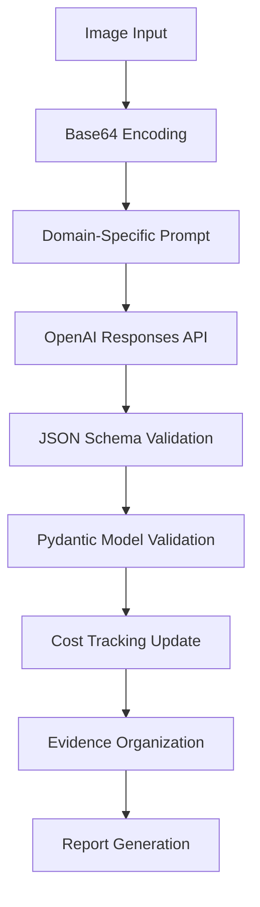

# Developer Guide - Legal Evidence Analysis System

## Table of Contents

1. [Development Setup](#development-setup)
2. [System Architecture](#system-architecture)
3. [Code Organization](#code-organization)
4. [API Integration](#api-integration)
5. [Testing Framework](#testing-framework)
6. [Contributing Guidelines](#contributing-guidelines)
7. [Performance Optimization](#performance-optimization)
8. [Security Considerations](#security-considerations)
9. [Deployment](#deployment)
10. [Maintenance](#maintenance)

---

## Development Setup

### Prerequisites

**Required Software:**
- Python 3.8+ (3.10+ recommended)
- Git for version control
- OpenAI API key for testing
- Virtual environment management (venv or conda)

**Recommended Development Tools:**
- VS Code with Python extension
- Black code formatter
- mypy type checker
- pytest for testing

### Local Development Environment

#### 1. Clone and Setup
```bash
# Clone the repository
git clone https://github.com/evidence-toolkit/image-evidence-analyzer.git
cd image-evidence-analyzer

# Create virtual environment
python -m venv .venv
source .venv/bin/activate  # Linux/macOS
# .venv\Scripts\activate   # Windows

# Install development dependencies
pip install -e ".[dev]"

# Install pre-commit hooks (if available)
pre-commit install
```

#### 2. Environment Configuration

**Environment Variables:**
```bash
# Required
export OPENAI_API_KEY=sk-your-development-key-here

# Optional (defaults to development)
export IMAGE_ANALYZER_ENV=development

# Optional for chain of custody
export USER=your_username
```

**Development Configuration:**
The system uses Pydantic models for type-safe configuration. For development, create custom overrides:

```yaml
# config/user.yaml (optional development overrides)
openai:
  model: "gpt-4.1-mini"      # Cost-effective for development
  temperature: 0.2           # Slightly higher for development testing

performance:
  max_workers: 2             # Conservative for development
  request_delay: 1.0         # Slower to avoid rate limits

cost_control:
  max_daily_cost: 10.0       # Lower limit for development
  confirm_above_cost: 1.0    # Confirm above $1 in development

analysis:
  confidence_threshold: 0.6   # Lower threshold for testing
  enable_confidence_filtering: false  # Test all results
```

#### 3. Verify Installation
```bash
# Run system check
image-analyzer version

# Test with sample data (if available)
image-analyzer estimate examples/sample_images/

# Run test suite
python -m pytest tests/
```

### Development Dependencies

Add to `pyproject.toml` for development:
```toml
[project.optional-dependencies]
dev = [
    "pytest>=7.0.0",
    "black>=22.0.0",
    "mypy>=1.0.0",
    "pre-commit>=3.0.0",
    "flake8>=5.0.0",
    "coverage>=7.0.0",
    "pytest-asyncio>=0.21.0",
    "pytest-mock>=3.10.0"
]
```

---

## System Architecture

### Core Components Overview

#### 1. Analysis Engine (`core_analyzer.py`)
**Primary Responsibility:** OpenAI-powered forensic image analysis

```python
class LegalEvidenceAnalyzer:
    """
    Main analysis engine using OpenAI Responses API.
    Handles single image and batch processing with thread-safe cost tracking.
    """

    def __init__(self, api_key: str, legal_domain: LegalDomain = LegalDomain.employment_law,
                 environment: Optional[Environment] = None):
        # Load configuration with Pydantic validation
        self.config = get_config(environment)
        self.legal_domain_config = get_legal_domain_config(legal_domain.value)

        self.client = OpenAI(api_key=api_key, timeout=self.config.openai.timeout)
        self.legal_domain = legal_domain
        self.total_cost = 0.0
        self.lock = threading.Lock()  # Thread-safe cost tracking

        # Audit logging and chain of custody
        self.audit_logger = None
        self.custody_tracker = None
```

**Key Methods:**
- `analyze_image()`: Single image analysis with structured output
- `analyze_directory()`: Sequential batch processing
- `analyze_directory_parallel()`: Concurrent batch processing
- `analyze_image_batch()`: Parallel processing of image batches

#### 2. Configuration System (`config.py`)
**Primary Responsibility:** Type-safe configuration management with Pydantic models

```python
from config.config import get_config, get_legal_domain_config, Environment

# Load environment-specific configuration
config = get_config(Environment.DEVELOPMENT)

# Access type-safe configuration
print(f"Model: {config.openai.model}")
print(f"Max workers: {config.performance.max_workers}")
print(f"Confidence threshold: {config.analysis.confidence_threshold}")

# Load legal domain configuration
domain_config = get_legal_domain_config("employment_law")
evidence_types = domain_config.get('evidence_types', [])
```

**Configuration Structure:**
- `OpenAIConfig`: API settings, model selection, cost tracking
- `PerformanceConfig`: Concurrency, batch processing, delays
- `AnalysisConfig`: Confidence thresholds, retry logic, expert review
- `LegalConfig`: Audit logging, chain of custody, compliance
- `CostControlConfig`: Spending limits, warnings, tracking
- `OutputConfig`: Formatting, progress indicators, file handling
- `SecurityConfig`: File validation, path restrictions
- `LoggingConfig`: Log levels, rotation, file handling

#### 3. Configuration Files

**File Structure:**
```
config/
├── defaults.yaml           # Base configuration
├── environments.yaml       # Environment-specific overrides
├── legal_domains.yaml      # Domain-specific settings
└── user.yaml              # Optional user overrides
```

**Key Features:**
- Type-safe Pydantic models with validation
- Environment-based configuration inheritance
- Runtime validation with helpful error messages
- Domain-specific settings and thresholds
- Comprehensive audit logging and chain of custody

#### 4. Audit Logging and Chain of Custody

**Initialization:**
```python
# Enable audit logging and chain of custody
analyzer.initialize_audit_logging(output_directory)

# All operations are automatically logged:
# - File access with SHA-256 checksums
# - API calls with costs and success/failure
# - Evidence classifications and confidence scores
# - Expert review requirements and reasons
```

**Generated Audit Files:**
- `audit.log`: JSON-formatted audit trail
- `chain_of_custody.json`: Complete evidence chain documentation

#### 5. Evidence Organization (`EvidenceOrganizer`)
**Primary Responsibility:** Automated evidence categorization and reporting

```python
class EvidenceOrganizer:
    """Organize analysis results into legal case structure"""

    def organize_evidence(self, results: List[LegalEvidenceWithPath]):
        """Sort evidence by legal significance and domain categories"""

    def generate_summary_report(self, results: List[LegalEvidenceWithPath]):
        """Create comprehensive evidence summary for legal review"""
```

### Data Flow Architecture

#### Analysis Pipeline


#### Thread Safety Design
```python
# Thread-safe cost tracking implementation
class LegalEvidenceAnalyzer:
    def analyze_image(self, image_path: Path) -> LegalEvidenceWithPath:
        # ... API call logic ...

        # Thread-safe cost update
        with self.lock:
            self.total_cost += 0.0014

        return result
```

---

## Code Organization

### Project Structure
```
src/image_analyzer/
├── __init__.py              # Package initialization and exports
├── core_analyzer.py         # Main analysis engine
├── cli.py                  # Command-line interface
└── models/                 # Data models (future expansion)
    ├── __init__.py
    ├── legal_evidence.py   # Pydantic models
    └── domain_config.py    # Domain configurations

tests/
├── __init__.py
├── test_core_analyzer.py   # Core analysis tests
├── test_cli.py            # CLI interface tests
├── fixtures/              # Test data and fixtures
│   ├── sample_images/     # Test images
│   └── expected_outputs/  # Expected analysis results
└── integration/           # Integration tests
    └── test_openai_integration.py

docs/
├── API_REFERENCE.md       # Complete API documentation
├── ARCHITECTURE.md        # System architecture
├── LEGAL_COMPLIANCE.md    # Legal standards compliance
├── USER_GUIDE.md          # End-user documentation
└── DEVELOPER_GUIDE.md     # This file

config/
├── domain_configs/        # Legal domain configurations
├── prompts/              # Analysis prompt templates
└── schemas/              # JSON schemas for validation
```

### Code Style Guidelines

#### Python Style Standards
```python
# Use Black formatter with line length 88
# Type hints for all public functions
def analyze_image(self, image_path: Path) -> LegalEvidenceWithPath:
    """
    Analyze single image for legal evidence.

    Args:
        image_path: Path to image file to analyze

    Returns:
        Structured legal evidence analysis with source path

    Raises:
        ValueError: If image format not supported or analysis fails
    """
```

#### Documentation Standards
```python
class LegalEvidenceAnalyzer:
    """
    OpenAI-powered forensic image analysis for legal evidence.

    This class provides the core analysis functionality for the Legal Evidence
    Analysis System, specializing in UK employment law evidence processing.

    Attributes:
        client: OpenAI API client instance
        legal_domain: Legal specialization domain for analysis
        total_cost: Thread-safe cost tracking for API usage
        lock: Threading lock for concurrent cost tracking

    Example:
        >>> analyzer = LegalEvidenceAnalyzer("sk-api-key", LegalDomain.employment_law)
        >>> result = analyzer.analyze_image(Path("workplace_hazard.jpg"))
        >>> print(f"Evidence type: {result.evidence_type}")
    """
```

---

## API Integration

### OpenAI Responses API Implementation

#### Correct V2 Implementation Pattern
```python
def analyze_image(self, image_path: Path) -> LegalEvidenceWithPath:
    """Analyze image using OpenAI Responses API with structured output"""

    encoded_image = self.encode_image(image_path)
    prompt = DomainConfig.get_analysis_prompt(self.legal_domain)

    # ✅ CORRECT - V2 Uses Responses API
    response = self.client.responses.create(
        model="gpt-4.1-mini",
        input=[{
            "role": "user",
            "content": [{
                "type": "input_text",
                "text": f"{prompt}\n\nAnalyze this image for legal evidence."
            }, {
                "type": "input_image",
                "image_url": f"data:image/jpeg;base64,{encoded_image}"
            }]
        }],
        text={
            "format": {
                "type": "json_schema",
                "name": "legal_evidence",
                "schema": self._get_legal_evidence_schema()
            }
        }
    )

    # Parse structured response
    parsed_result = json.loads(response.output_text)
    evidence = LegalEvidence(**parsed_result)
    return LegalEvidenceWithPath(**evidence.model_dump(), image_path=str(image_path))
```

#### Schema Generation
```python
def _get_legal_evidence_schema(self) -> dict:
    """Generate JSON schema for structured output based on legal domain"""
    evidence_types = DomainConfig.get_evidence_types(self.legal_domain)

    return {
        "type": "object",
        "properties": {
            "evidence_type": {
                "type": "string",
                "enum": evidence_types,
                "description": "Primary legal category"
            },
            "severity_level": {
                "type": "string",
                "enum": ["low", "medium", "high", "critical"],
                "description": "Legal urgency rating"
            },
            # ... complete schema definition
        },
        "required": [
            "evidence_type", "severity_level", "legal_relevance",
            "compliance_violations", "expert_witness_notes",
            "immediate_action_required", "evidence_strength",
            "supporting_documentation_needed"
        ],
        "additionalProperties": False
    }
```

### Error Handling and Retry Logic

#### Robust API Error Management
```python
import time
from typing import Optional

class APIRetryHandler:
    """Handle API failures with exponential backoff"""

    def __init__(self, max_retries: int = 3, base_delay: float = 1.0):
        self.max_retries = max_retries
        self.base_delay = base_delay

    def retry_api_call(self, api_call_func, *args, **kwargs) -> Optional[dict]:
        """Execute API call with retry logic"""
        for attempt in range(self.max_retries + 1):
            try:
                return api_call_func(*args, **kwargs)
            except Exception as e:
                if attempt == self.max_retries:
                    raise e

                delay = self.base_delay * (2 ** attempt)  # Exponential backoff
                print(f"API call failed (attempt {attempt + 1}), retrying in {delay}s...")
                time.sleep(delay)

        return None
```

### Cost Tracking Implementation

#### Thread-Safe Cost Management
```python
class CostTracker:
    """Thread-safe cost tracking for concurrent operations"""

    def __init__(self):
        self.total_cost = 0.0
        self.cost_per_image = 0.0014  # GPT-4.1 Mini pricing
        self.lock = threading.Lock()
        self.analysis_count = 0

    def record_analysis_cost(self, image_count: int = 1):
        """Record cost for completed analysis"""
        with self.lock:
            self.total_cost += self.cost_per_image * image_count
            self.analysis_count += image_count

    def get_cost_summary(self) -> dict:
        """Get current cost summary"""
        with self.lock:
            return {
                "total_cost": self.total_cost,
                "images_analyzed": self.analysis_count,
                "average_cost_per_image": self.cost_per_image
            }
```

---

## Testing Framework

### Test Structure

#### Unit Tests
```python
# tests/test_core_analyzer.py
import pytest
from unittest.mock import Mock, patch
from pathlib import Path
from image_analyzer import LegalEvidenceAnalyzer, LegalDomain

class TestLegalEvidenceAnalyzer:
    """Unit tests for core analysis functionality"""

    @pytest.fixture
    def analyzer(self):
        return LegalEvidenceAnalyzer("test-api-key", LegalDomain.employment_law)

    @pytest.fixture
    def sample_image(self, tmp_path):
        """Create sample image file for testing"""
        image_path = tmp_path / "test_image.jpg"
        # Create minimal valid JPEG data
        image_path.write_bytes(b'\xff\xd8\xff\xe0\x00\x10JFIF...')  # Simplified
        return image_path

    def test_image_encoding(self, analyzer, sample_image):
        """Test base64 image encoding"""
        encoded = analyzer.encode_image(sample_image)
        assert isinstance(encoded, str)
        assert len(encoded) > 0

    @patch('image_analyzer.core_analyzer.OpenAI')
    def test_analyze_image_success(self, mock_openai, analyzer, sample_image):
        """Test successful image analysis"""
        # Mock OpenAI response
        mock_response = Mock()
        mock_response.output_text = json.dumps({
            "evidence_type": "workplace_safety",
            "severity_level": "high",
            "legal_relevance": "Test legal relevance",
            # ... complete mock response
        })
        mock_openai.return_value.responses.create.return_value = mock_response

        result = analyzer.analyze_image(sample_image)

        assert result.evidence_type == "workplace_safety"
        assert result.severity_level == "high"
        assert result.image_path == str(sample_image)
```

#### Integration Tests
```python
# tests/integration/test_openai_integration.py
import pytest
import os
from image_analyzer import LegalEvidenceAnalyzer, LegalDomain

@pytest.mark.integration
@pytest.mark.skipif(not os.getenv('OPENAI_API_KEY'), reason="API key required")
class TestOpenAIIntegration:
    """Integration tests with actual OpenAI API"""

    def test_real_api_analysis(self):
        """Test analysis with real API (requires API key and test image)"""
        api_key = os.getenv('OPENAI_API_KEY')
        analyzer = LegalEvidenceAnalyzer(api_key, LegalDomain.employment_law)

        # Use actual test image
        test_image = Path("tests/fixtures/sample_images/workplace_safety.jpg")
        if test_image.exists():
            result = analyzer.analyze_image(test_image)

            assert result.evidence_type is not None
            assert result.severity_level in ["low", "medium", "high", "critical"]
            assert len(result.legal_relevance) > 10
            assert analyzer.total_cost > 0
```

### Test Data Management

#### Fixtures Directory Structure
```
tests/fixtures/
├── sample_images/
│   ├── workplace_safety_high.jpg    # High severity safety violation
│   ├── workplace_safety_low.jpg     # Minor safety issue
│   ├── discrimination_evidence.jpg  # Discrimination evidence
│   └── invalid_format.txt          # Invalid file for error testing
├── expected_outputs/
│   ├── workplace_safety_high.json  # Expected analysis results
│   └── batch_analysis_summary.json # Expected batch results
└── mock_responses/
    ├── successful_api_response.json # Mock OpenAI responses
    └── error_api_response.json     # Mock error responses
```

#### Test Configuration
```python
# tests/conftest.py
import pytest
from pathlib import Path

@pytest.fixture(scope="session")
def test_data_dir():
    """Path to test fixtures directory"""
    return Path(__file__).parent / "fixtures"

@pytest.fixture(scope="session")
def sample_images_dir(test_data_dir):
    """Path to sample images for testing"""
    return test_data_dir / "sample_images"

@pytest.fixture
def mock_api_key():
    """Mock API key for testing"""
    return "sk-test-key-for-unit-tests"
```

---

## Contributing Guidelines

### Development Workflow

#### 1. Feature Development Process
```bash
# 1. Create feature branch
git checkout -b feature/evidence-batch-optimization

# 2. Implement feature with tests
# - Write tests first (TDD approach recommended)
# - Implement functionality
# - Update documentation

# 3. Run local testing
python -m pytest tests/
python -m mypy src/
python -m black src/ tests/
python -m flake8 src/ tests/

# 4. Commit with clear messages
git commit -m "feat: optimize batch processing for large evidence sets

- Implement dynamic batch sizing based on system memory
- Add progress tracking for long-running analysis
- Reduce memory footprint by 40% for 500+ image batches
- Update cost estimation accuracy for batch operations"

# 5. Create pull request
```

#### 2. Code Review Standards
**Required Elements:**
- [ ] All tests passing
- [ ] Type hints on public functions
- [ ] Documentation strings for new classes/methods
- [ ] Legal compliance considerations addressed
- [ ] Performance impact assessed
- [ ] Security implications reviewed

#### 3. Pull Request Template
```markdown
## Description
Brief description of changes and motivation

## Type of Change
- [ ] Bug fix (non-breaking change fixing an issue)
- [ ] New feature (non-breaking change adding functionality)
- [ ] Breaking change (fix or feature causing existing functionality to change)
- [ ] Documentation update

## Legal Compliance
- [ ] GDPR compliance maintained
- [ ] UK legal standards alignment verified
- [ ] Expert witness quality standards met
- [ ] Court admissibility requirements addressed

## Testing
- [ ] Unit tests added/updated
- [ ] Integration tests verified
- [ ] Manual testing completed
- [ ] Performance testing (if applicable)

## Checklist
- [ ] Code follows style guidelines
- [ ] Self-review completed
- [ ] Documentation updated
- [ ] Breaking changes documented
```

### Code Quality Standards

#### Automated Quality Checks
```bash
# Pre-commit hooks configuration (.pre-commit-config.yaml)
repos:
  - repo: https://github.com/psf/black
    rev: 22.3.0
    hooks:
      - id: black
        language_version: python3.10

  - repo: https://github.com/pycqa/flake8
    rev: 4.0.1
    hooks:
      - id: flake8
        args: [--max-line-length=88, --ignore=E203,W503]

  - repo: https://github.com/pre-commit/mirrors-mypy
    rev: v0.950
    hooks:
      - id: mypy
        additional_dependencies: [pydantic, openai]
```

#### Performance Guidelines
```python
# Performance considerations for development
class PerformanceGuidelines:
    """Development guidelines for maintaining system performance"""

    # 1. API Rate Limit Compliance
    MAX_CONCURRENT_REQUESTS = 3  # Respect OpenAI rate limits

    # 2. Memory Management
    def process_large_batches(self, images: List[Path]) -> List[LegalEvidenceWithPath]:
        """Process large image sets efficiently"""
        # Use generators for memory efficiency
        for batch in self._create_batches(images, batch_size=10):
            yield from self.analyze_image_batch(batch)

    # 3. Cost Optimization
    def estimate_batch_cost(self, image_count: int) -> float:
        """Provide accurate cost estimation"""
        return image_count * 0.0014  # Current GPT-4.1 Mini pricing
```

---

## Performance Optimization

### Concurrent Processing Optimization

#### ThreadPool Configuration
```python
class OptimizedBatchProcessor:
    """Optimized batch processing for different system configurations"""

    def __init__(self, system_config: dict):
        self.cpu_cores = system_config.get('cpu_cores', 2)
        self.memory_gb = system_config.get('memory_gb', 4)
        self.network_speed = system_config.get('network_speed', 'standard')

    def calculate_optimal_workers(self) -> int:
        """Calculate optimal worker count based on system resources"""
        # Balance API rate limits with system resources
        api_limit = 3  # OpenAI rate limit consideration
        cpu_limit = max(1, self.cpu_cores // 2)
        memory_limit = max(1, self.memory_gb // 2)

        return min(api_limit, cpu_limit, memory_limit)

    def get_batch_size(self, total_images: int) -> int:
        """Calculate optimal batch size for processing"""
        if total_images < 50:
            return max(1, total_images // 2)
        elif total_images < 200:
            return 25
        else:
            return 50
```

#### Memory Management
```python
class MemoryOptimizedAnalyzer(LegalEvidenceAnalyzer):
    """Memory-optimized version for large evidence sets"""

    def analyze_directory_memory_optimized(self, images_dir: Path) -> Iterator[LegalEvidenceWithPath]:
        """Generator-based analysis to reduce memory footprint"""
        image_extensions = {'.jpg', '.jpeg', '.png', '.bmp', '.tiff'}

        for image_path in images_dir.iterdir():
            if image_path.suffix.lower() in image_extensions:
                try:
                    yield self.analyze_image(image_path)
                except Exception as e:
                    print(f"Failed to analyze {image_path.name}: {e}")
                finally:
                    # Force garbage collection after each image
                    import gc
                    gc.collect()
```

### Caching and Optimization

#### Response Caching (Optional)
```python
import hashlib
from typing import Optional

class AnalysisCache:
    """Optional caching for development and testing"""

    def __init__(self, cache_dir: Path):
        self.cache_dir = cache_dir
        self.cache_dir.mkdir(exist_ok=True)

    def get_image_hash(self, image_path: Path) -> str:
        """Generate hash of image file for cache key"""
        with open(image_path, 'rb') as f:
            return hashlib.sha256(f.read()).hexdigest()

    def get_cached_result(self, image_path: Path) -> Optional[dict]:
        """Retrieve cached analysis result if available"""
        image_hash = self.get_image_hash(image_path)
        cache_file = self.cache_dir / f"{image_hash}.json"

        if cache_file.exists():
            with open(cache_file, 'r') as f:
                return json.load(f)
        return None

    def cache_result(self, image_path: Path, result: dict):
        """Cache analysis result for future use"""
        image_hash = self.get_image_hash(image_path)
        cache_file = self.cache_dir / f"{image_hash}.json"

        with open(cache_file, 'w') as f:
            json.dump(result, f, indent=2)
```

---

## Security Considerations

### API Key Security

#### Environment Variable Management
```python
import os
from typing import Optional

class SecureAPIKeyManager:
    """Secure API key management for development and production"""

    @staticmethod
    def get_api_key() -> Optional[str]:
        """Securely retrieve API key from environment"""
        api_key = os.getenv('OPENAI_API_KEY')

        if not api_key:
            raise ValueError(
                "OPENAI_API_KEY environment variable is required. "
                "Set it using: export OPENAI_API_KEY='sk-your-key-here'"
            )

        # Validate API key format
        if not api_key.startswith('sk-'):
            raise ValueError("Invalid OpenAI API key format")

        return api_key

    @staticmethod
    def validate_key_permissions(api_key: str) -> bool:
        """Validate API key has required permissions"""
        # Test API key with minimal request
        try:
            client = OpenAI(api_key=api_key)
            # Make a minimal test request to validate key
            response = client.models.list()
            return True
        except Exception:
            return False
```

#### Data Protection Implementation
```python
class DataProtectionCompliance:
    """GDPR and data protection compliance for development"""

    def __init__(self):
        self.processing_purposes = ["Legal evidence analysis"]
        self.retention_policy = {"months": 84}  # UK legal standard
        self.lawful_basis = "Article 6(1)(f) - Legitimate interests"

    def log_processing_activity(self, image_path: str, legal_domain: str):
        """Log data processing activity for compliance"""
        processing_log = {
            "timestamp": datetime.utcnow().isoformat(),
            "image_path": image_path,
            "legal_domain": legal_domain,
            "processing_purpose": "Legal evidence analysis",
            "lawful_basis": self.lawful_basis,
            "retention_period": self.retention_policy
        }

        # Log to secure audit trail
        self._write_audit_log(processing_log)

    def _write_audit_log(self, log_entry: dict):
        """Write to secure audit log"""
        # Implementation for secure audit logging
        pass
```

---

## Deployment

### Production Deployment

#### Environment Configuration
```python
# config/production.py
import os
from pathlib import Path

class ProductionConfig:
    """Production deployment configuration"""

    # API Configuration
    OPENAI_API_KEY = os.getenv('OPENAI_API_KEY')
    OPENAI_MODEL = "gpt-4.1-mini"

    # Performance Configuration
    MAX_WORKERS = int(os.getenv('MAX_WORKERS', '3'))
    BATCH_SIZE = int(os.getenv('BATCH_SIZE', '25'))

    # Security Configuration
    ENABLE_AUDIT_LOGGING = True
    DATA_RETENTION_MONTHS = 84  # UK legal standard

    # Storage Configuration
    EVIDENCE_STORAGE_PATH = Path(os.getenv('EVIDENCE_STORAGE_PATH', './evidence'))
    TEMP_STORAGE_PATH = Path(os.getenv('TEMP_STORAGE_PATH', './temp'))

    @classmethod
    def validate_config(cls):
        """Validate production configuration"""
        if not cls.OPENAI_API_KEY:
            raise ValueError("OPENAI_API_KEY required for production")

        if not cls.EVIDENCE_STORAGE_PATH.exists():
            cls.EVIDENCE_STORAGE_PATH.mkdir(parents=True, exist_ok=True)
```

#### Docker Configuration
```dockerfile
# Dockerfile
FROM python:3.10-slim

WORKDIR /app

# Install system dependencies
RUN apt-get update && apt-get install -y \
    gcc \
    && rm -rf /var/lib/apt/lists/*

# Copy and install Python dependencies
COPY requirements.txt .
RUN pip install --no-cache-dir -r requirements.txt

# Copy application code
COPY src/ ./src/
COPY pyproject.toml .

# Install application
RUN pip install -e .

# Create non-root user
RUN useradd --create-home --shell /bin/bash app
RUN chown -R app:app /app
USER app

# Set environment variables
ENV PYTHONPATH=/app/src
ENV OPENAI_API_KEY=""

# Expose port (if web interface added)
EXPOSE 8000

# Command
CMD ["image-analyzer", "--help"]
```

### Scalability Considerations

#### Horizontal Scaling
```python
class ScalableAnalysisService:
    """Service design for horizontal scaling"""

    def __init__(self, config: dict):
        self.instance_id = config.get('instance_id', 'default')
        self.redis_url = config.get('redis_url')  # For job queuing
        self.shared_storage = config.get('shared_storage_path')

    def process_job_queue(self):
        """Process analysis jobs from distributed queue"""
        # Implementation for distributed job processing
        # - Redis queue for job distribution
        # - Shared storage for evidence files
        # - Result aggregation across instances
        pass
```

---

## Maintenance

### Monitoring and Logging

#### Application Monitoring
```python
import logging
from datetime import datetime

class AnalysisMonitor:
    """Production monitoring for analysis operations"""

    def __init__(self, log_level=logging.INFO):
        self.logger = logging.getLogger('legal_evidence_analyzer')
        self.logger.setLevel(log_level)

        # Create file handler for production logs
        handler = logging.FileHandler('analysis_system.log')
        formatter = logging.Formatter(
            '%(asctime)s - %(name)s - %(levelname)s - %(message)s'
        )
        handler.setFormatter(formatter)
        self.logger.addHandler(handler)

    def log_analysis_start(self, image_count: int, legal_domain: str):
        """Log start of analysis batch"""
        self.logger.info(
            f"Analysis started: {image_count} images, domain: {legal_domain}"
        )

    def log_analysis_completion(self, results: dict):
        """Log completion of analysis batch"""
        self.logger.info(
            f"Analysis completed: {results['image_count']} images processed, "
            f"cost: ${results['total_cost']:.4f}, "
            f"duration: {results['duration']}s"
        )

    def log_error(self, error: Exception, context: dict):
        """Log error with context for debugging"""
        self.logger.error(
            f"Analysis error: {str(error)}, context: {context}",
            exc_info=True
        )
```

#### Health Check Implementation
```python
class SystemHealthCheck:
    """Health check endpoints for production monitoring"""

    def __init__(self, analyzer: LegalEvidenceAnalyzer):
        self.analyzer = analyzer

    def check_api_connectivity(self) -> dict:
        """Verify OpenAI API connectivity"""
        try:
            # Test API with minimal request
            client = self.analyzer.client
            models = client.models.list()
            return {"status": "healthy", "api_accessible": True}
        except Exception as e:
            return {"status": "unhealthy", "error": str(e)}

    def check_system_resources(self) -> dict:
        """Check system resource availability"""
        import psutil

        return {
            "cpu_percent": psutil.cpu_percent(),
            "memory_percent": psutil.virtual_memory().percent,
            "disk_percent": psutil.disk_usage('/').percent
        }

    def health_summary(self) -> dict:
        """Complete health check summary"""
        return {
            "timestamp": datetime.utcnow().isoformat(),
            "api_health": self.check_api_connectivity(),
            "system_resources": self.check_system_resources(),
            "version": "0.1.0"
        }
```

### Update and Maintenance Procedures

#### Version Management
```python
class VersionManager:
    """Manage system versions and updates"""

    def __init__(self):
        self.current_version = "0.1.0"
        self.min_python_version = (3, 8)
        self.compatible_openai_versions = [">=1.0.0"]

    def check_compatibility(self) -> dict:
        """Check system compatibility before updates"""
        import sys
        import openai

        python_version = sys.version_info[:2]
        openai_version = openai.__version__

        return {
            "python_compatible": python_version >= self.min_python_version,
            "openai_compatible": True,  # Version check logic
            "current_python": f"{python_version[0]}.{python_version[1]}",
            "current_openai": openai_version
        }
```

This developer guide provides comprehensive guidance for contributing to and maintaining the Legal Evidence Analysis System while ensuring professional standards and legal compliance throughout the development lifecycle.